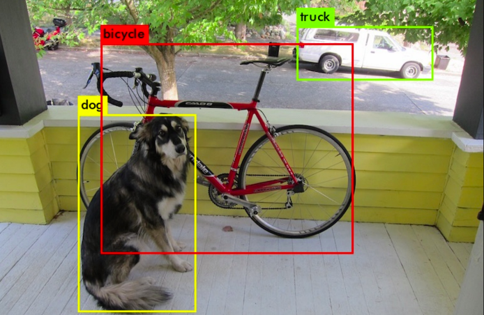

<p align="center">
  
</p>

# 🤖 AI Object Detection System

A real-time **web-based AI object detection** system built using **TensorFlow.js** and **ml5.js**.  
This project uses your **device camera** to detect objects instantly in your browser — no backend, no installation required.

---

# 🌟 Badges


---

## 🚀 Features

- 👁️ Live object detection using your webcam  
- 🔄 Toggle button to turn detection ON/OFF  
- 🎚 Adjustable frame rate (FPS control)  
- ⚡ Runs 100% in browser  
- 📱 Works on mobile browsers  
- 🌐 Supports Chrome, Firefox, Edge  

---

## 🌐 Live Demo (Reference Project)

Try a similar working demo:

👉 https://woody.pizza/tensorflow/object-detection/

---

## 🛠️ Technologies Used

- **JavaScript**
- **HTML5 / CSS3**
- **TensorFlow.js**
- **ml5.js** (MobileNet / COCO-SSD model)
- **Materialize CSS**
- **Webcam API**

---

## 📂 Project Setup (Run Locally)

### 1️⃣ Clone the repository
```bash
git clone https://github.com/jeevan9741/Ai_object_detection-_system.git
cd Ai_object_detection-_system


# 🖼️ Screenshots

## Screenshot 1


## Screenshot 2


## Screenshot 3


#<------------------------->
# ▶️ Run Command (Quick Start)

If you want to run the project immediately, open a terminal inside the project folder and run:

#  bash
python -m http.server 8080

# Then open your browser and go to:->
http://localhost:8080


#//<------------------------------------------------------------->//

# 👍 If you prefer Node.js, also add:

#  md
### Or using Node.js:

#  bash
http-server


